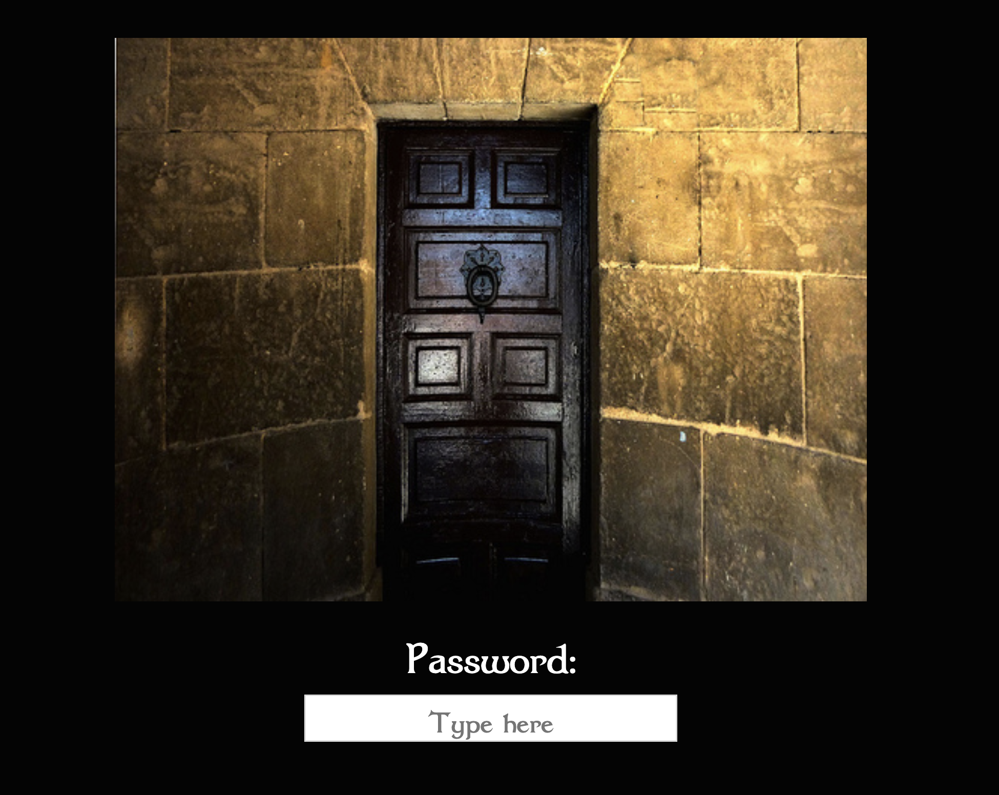

Pensieve puzzle hunt
====================

This is the puzzle hunt given to Runpeng in Winter break of 2019. The initial email was sent on December 22nd at 3:15AM GMT, and the final meta was solved by Runpeng on December 24th at 6:39PM GMT. Congratulations!

The puzzle hunt server is running [here](http://util.in:8090). Click on the picture of the door to see the contents of the initial email (which contains the intro puzzle that gives the password). After entering the password, the link directs to the main pensieve page.

### Preview

The entrance

The home page

Sample puzzle

### Quickstart

    $ cd pensieve-puzzle-hunt
    $ yarn && yarn build  # builds frontend assets
    $ ./gradlew run  # starts server

Visit `localhost:8090`.

### Development

This service is tested on Java 11 and Yarn 1.19.1. The Java backend files is in `src/`, and the frontend Javascript files are in `web/`.

    $ ./gradlew eclipse  # sets up Eclipse project
    $ yarn start  # runs Webpack dev server

### Solutions

The solutions are [here](static/solutions.md).

